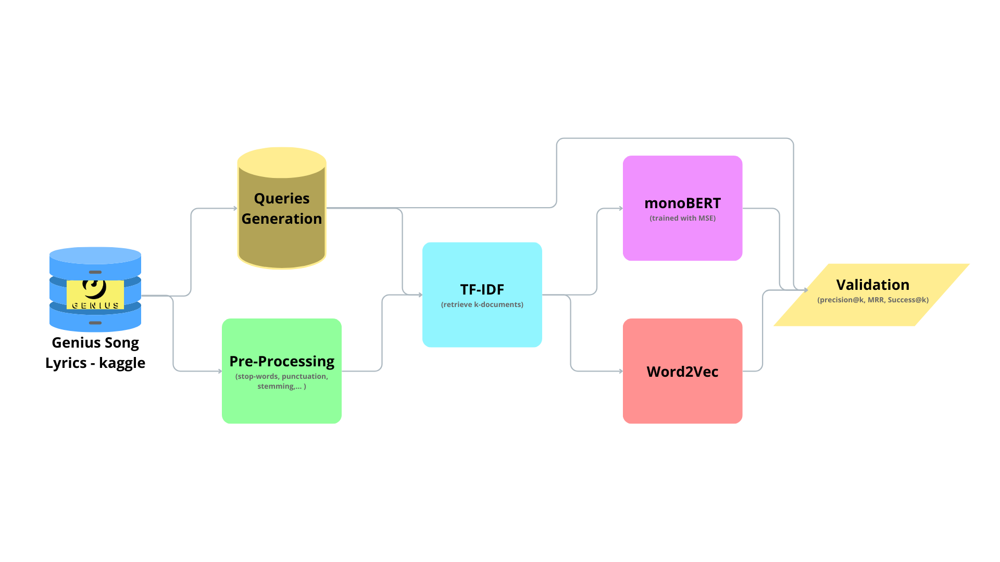

# Genius Lyrics Search
> Advanced Song Search Using Lyrics

## General info
We built an information retrieval pipeline that allows searching for a song using its lyrics.

This is a research project done as part of the course "Advanced Information Retrieval" at the Technical University of Graz.

## Data & Preprocessing

Documents (lyrics):
- We used the [Genius Song Lyrics Dataset](https://www.kaggle.com/datasets/carlosgdcj/genius-song-lyrics-with-language-information/) from Kaggle.
  - The 5 million songs take up over 9 GB of memory, so for our purposes, we had to limit ourselves to just 100k songs to make working with the dataset easier.
- We preprocessed the lyrics data by... 
  - taking only english songs
  - removing some corrupted lyrics
  - removing stopwords & punctuation
  - stemming the words

Queries & training data:
- We generated queries for the songs by randomly...
  - taking the first verses
  - or taking the first verses of the chorus
  - or taking some random verses.
- Queries were perturbed by randomly...
  - removing some words or letters,
  - switching letters,
  - introducing typos (of neighboring keys),
  - introducing common misspellings.

## Pipeline

1. Retrieval: **TF-IDF** (top 100 results)
2. Re-ranking: **monoBERT** and **word2vec** (top 10 results) 
Please note that word2vec was not fully implemented in time for the deadline.
3. Evaluation: **MRR**, **Hitrate@k**, **Precision@k**

## Results

In our limited testing, the model did not perform _that_ well.
Since the word2vec implementation wasn't finished in time for the deadline, we only used monoBERT for re-ranking and could not compare it to the other re-ranker.

When testing the performance using 300 queries, we got the following results:
- Mean hitrate@10: 40.00% 
- Mean MRR: 0.2505 
- Mean Precision@10: 4.00% (to be expected, since it's the same as hitrate@10 divided by 10)

When testing TF-IDF on 10,000 queries without re-ranking, we got the following results:

| Mean hitrate |  Value |
|----:|-------:|
|  @1 |  5.47% |
| @10 | 14.93% |
| @50 | 27.00% |
| @100 | 34.27% |
| @500 | 53.24% |

This indicates that the re-ranker monoBERT performs rather well, given that many relevant documents aren't retrieved by TF-IDF in the first place. It manages to return the correct document in the top 10 results in 40% of the cases, on average even in the top 4 results.